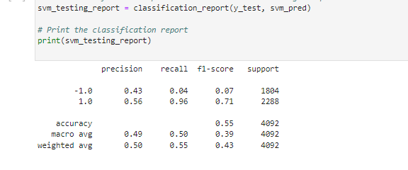

# Unit-14-Machine-Learning-Trading-Bot

### Conclusions - Baseline Algorithm ( SVC ) - ***Senario 1***
With regards to Support Vector Machines (SVC(),default setting with  kernal = ‘rbf’) model, it has similar return patterns as “Actual Return” 

Since 2019, the trend is still similar, but its accumulated return has consistently outperformed “Actual Return’.

From “Classification Report” ,  the model has high recall rate (0.96) in predicting 1.0, meaning it has high accuracy on predicting fund’s  “positive” return , however it has very poor (0.04) accuracy in predicting fund’s “negative” return (-1.0).

Overall it has around 0.50 accuracy. 

---

### Turn the Baseline Algorithm - ( Training Dataset ) - ***Senario 2*** 

By changing the training dataset from 3 months (baseline) to 24 months, all other variables remains unchanged (only testing dataset is reduced accordingly), we see its similar patterns as Baseline Case,  but it managed quite well when the fund suffered large negative returns during 2020, 

---
### Turn the Baseline Algorithm - ( SMA features ) - ***Senario 3***

By increasing both  SMA windows from `4 & 100` to `10 & 250`, we see since the beginning 2019, it outperforms “Actual Return”, which we can not see from Senario 1 & 2. However, it subsequently consistently underperforms “Actual Return”. 

---
### LogisticRegression Model Algorithm - ***Senario 4***

With regards to a new model of Logistic Regression, it has outperformed “Actual Return” since 2019. it also starts to out-performs the Baseline Algorithm (Scenario 1), and Senario 2 & 3.  However from early 2021, it starts to poorly predict fund’s ‘positive’ return.

Overall, this model has improved the success rate (recall rate improved 0.04 to 0.33) for predicting -1.0 (fund negative return), which maybe could explain that it has better performance than all other scenarios during ***FLAT*** market (during 20018-2020)

